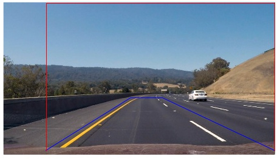
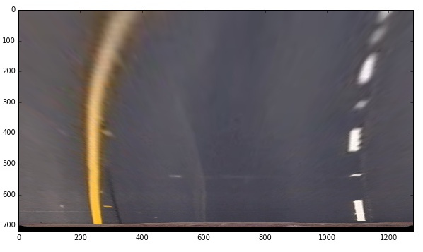
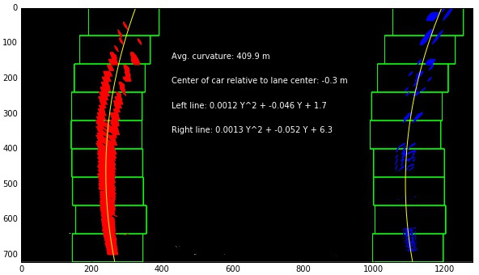
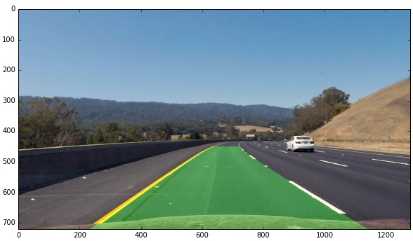

##Road Lane Lines Detection
###A software pipeline to identify the lane boundaries in a video from a front-facing camera on a car.

---

**The pipeline includes the following features:**

* Compute the camera calibration matrix and distortion coefficients given a set of chessboard images.
* Apply a distortion correction to raw images.
* Use color transforms, gradients, etc., to create a thresholded binary image.
* Apply a perspective transform to rectify binary image ("birds-eye view").
* Detect lane pixels and fit to find the lane boundary.
* Determine the curvature of the lane and vehicle position with respect to center.
* Warp the detected lane boundaries back onto the original image.
* Output visual display of the lane boundaries and numerical estimation of lane curvature and vehicle position.

[//]: # (Image References)

[image7]: ./output_images/calibration2.jpg "Undistorted"
[image8]: ./output_images/calibration3.jpg "Undistorted"
[image9]: ./output_images/test2.jpg "Undistorted"
[image10]: ./output_images/test3.jpg "Undistorted"
[image11]: ./output_images/thresholded_2.jpg "Undistorted"


###Camera Calibration
The camera is calibrated using a set of "object points" and "image points" that are extracted from calibration images in "./camera_cal/" directory. The image points are extracted from the calibration images by an OpenCV function called `findChessboardCorners()' and visualized with `drawChessboardCorners()` again available in OpenCV. The object points are basically set to be a uniform grid of 9x6 based on the fact that the chessboard had the same number of grid points.

Once the image points and corresponding object points are found, the  camera calibration parameters and distortion matrix are determined by `ret, mtx, dist, rvecs, tvecs = cv2.calibrateCamera(objpoints, imgpoints, gray.shape[::-1],None,None)` where `objpoints` and `imgpoints` are the arrays containing the object points and image points respectively.

The images can then be *undistorted*  by using the distortion matrix and OpenCV function `dst = cv2.undistort(img, mtx, dist, None, mtx)`. Examples of calibration and undistorted images are shown below.
![alt text][image7]
![alt text][image8]

 ###Pipeline (single images)
 
 ####1. Distortion correction on video frames
 The same transformation is applied on the video to undistort the frames. The following figures show two examples of original and undistorted images. Note that most of the objects are farther than the chessboard the undistorted effect is less apparent in this images compared to the calibration ones.
![alt text][image9]
![alt text][image10]


####2. Feature extraction by  color transformation and gradient thresholding
Four methods are implemented for finding the edges from different gradients and color space transformation.

* `s_threshold(img,thresh)`: converts the `img` to HSL color-space and thresholds the *Saturation (s)* channel
* `abs_sobel_thresh(img, orient, sobel_kernel, thresh)`: converts the image to gray-scale, calculates the gradient along the `orient` direction using a Sobel kernel with size `sobel_kernel` and binarizes the result based on the given threshold `thres`.
* `mag_thresh(img, sobel_kernel, mag_thresh)`: Similar to `abs_sobel_thresh()` except that it applies the thresholding on the magnitude of gradient instead of a particular direction.
* `dir_threshold(img, sobel_kernel, thresh)`: Similar to `abs_sobel_thresh()` except that it applies the thresholding on the gradient angle instead of the gradient intensity along a particular direction.

After some manual iterations the binarized images are generated by combining the images from gradients along the x-direction and *Saturation* channel thresholding. This is implemented in `combine_thresholds(img)` function. 
The final tuned parameters are given below:

1. sxbinary = abs_sobel_thresh(img, orient='x', sobel_kernel=ksize, thresh=(50, 100))
2. s_binary = s_threshold(img,(170,255))

![alt text][image11]

The above figures show the individual thresholded images color coded (left) and combined (right). On the left plot, the green channel illustrates the thresholded image based on the gradient along x-direction (i.e. `sxbinary` in the above code) and the blue channels represents the thresholding on the Saturation channel (i.e. `s_binary`).


####3. Perspective transformation
Bird's eye view of video frames are generated by perspective transformation. The transformation matrix `M` is calculated by
OpenCV function `M = cv2.getPerspectiveTransform(src, dst)` where `src` and `dst` are the source and destination points
of transformation. The source points are the vertices of a trapezoid that is drawn around the main lane. 
The source and destination points are set in the following lines

```
imshape = img.shape
x1 = 200
oh = 20
h = 450
src = np.array([(x1,imshape[0]-oh),(600, h), (750, h), (imshape[1],imshape[0]-oh)], dtype=np.float32)
dst = np.array([(x1,imshape[0]-oh),(x1, 0), (imshape[1], 0), (imshape[1],imshape[0]-oh)], dtype=np.float32)

M = cv2.getPerspectiveTransform(src, dst)
Minv = cv2.getPerspectiveTransform(dst, src)

```
which resulted in the following values for the given video:

| Source (x,y)        | Destination (x,y)  |  Description |
|:-------------:|:-------------:| :-------------:| 
| 200, 700      | 200, 700        |  Bottom left |
| 600, 450      | 200, 0      | Top left
| 750, 450     | 1280, 0      | Top right |
| 1280, 700      | 1280, 700        | Bottom right |

and are shown in the following plot (blue: src, red: dst)
 

It can be verified that perspective transform is working as expected by drawing the `src` and `dst` points onto the above test image and its warped counterpart which is shown below. Note that the lines appear parallel in the warped image.

 

####4. Lane-line pixels detection and polynomial fitting
After applying calibration, thresholding, and a perspective transform to a road image, we have binary images where the lane lines stand out clearly. Once the thresholded warped images are created, the lane lines are detected by looking at the peaks of indensity histogram inside small windows. That is, we take a histogram along all the columns in the lower half of the image `histogram = np.sum(img[img.shape[0]/2:,:], axis=0)`. The two most prominent peaks in this histogram will be good indicators of the x-position of the base of the lane lines. We use that as a starting point for where to search for the lines. From that point, we can use a sliding window, placed around the line centers, to find and follow the lines up to the top of the frame. The results for our running example looks like this:

 

####5. Radius of curvature of the lane and the position of the vehicle with respect to center.

A second order polynomial is fit to the x-y position of the detected pixels for each line. 

In order to find the position of the car with respect to the lane center we first calculate the intercept of the fitted lines with 
the lower edge (i.e. by finding x for maximum y). The lane center is the average of the two intercept points and the car center is assumed to be the center of the image. The offset between these two values is calculated and scaled by a 
pixel-to-meter value of s = 3.7m/700pixels. 

The radius of curvature ([awesome tutorial here](http://www.intmath.com/applications-differentiation/8-radius-curvature.php)) at any point x of the function x=f(y) is given as follows:
R_​curve ​​ = (1+(2Ay+B)^2)^1.5 / (2A)
​
where A is the quadratic coefficient term of the fit and B is the coefficient for the linear term. Curvature radius for the car
is calculated by setting y to the maximum value in the image.
​​
The values of fit coefficients, curvature radius and car position are shown in the above figure and 
calculated in 
```
calculate_curvature_offset()
```
​​ which is used inside
```
plot_windows()
```


####6. Plotting back down onto the road to identified the lanes in the original image

Once the lane lines are detected and polynomials are fitted to them, we fill the region between the two lines with
the OpenCV function `fillpoly` and transform it back to the original image space by using the inverse of warping matrix `M` which was called `Minv` earlier in the code. This provides the final output of the pipeline and looks like this for our running example:

 

---

###Final video output
Here's a [link](https://youtu.be/DCf4QFCExg8)  to the video result on youtube!

 

---

###Discussion

####1. Potential failures
The algorithm may break when the line colors are neither white nor yellow. It also may be confused when the lines are close to guardrails and curbs since they both causes vertical lines similar to the lanes in the image.

####2. Future work
One can improve the current algorithm by taking the temporal relation between the position of lines in consecutive frames. 
Bayesian filtering of lane line position would be a simple method to do so. For instance, the histogram we calculate in
each frame can be normalized to a probability distribution and used in the next frame as a prior probability. The 
position of lines is then defined as the argmax of posterior probability. 
More complex methods like Kalman filtering and particle filtering can be employed to incorporate the speed and car dynamics as well.
the car 
